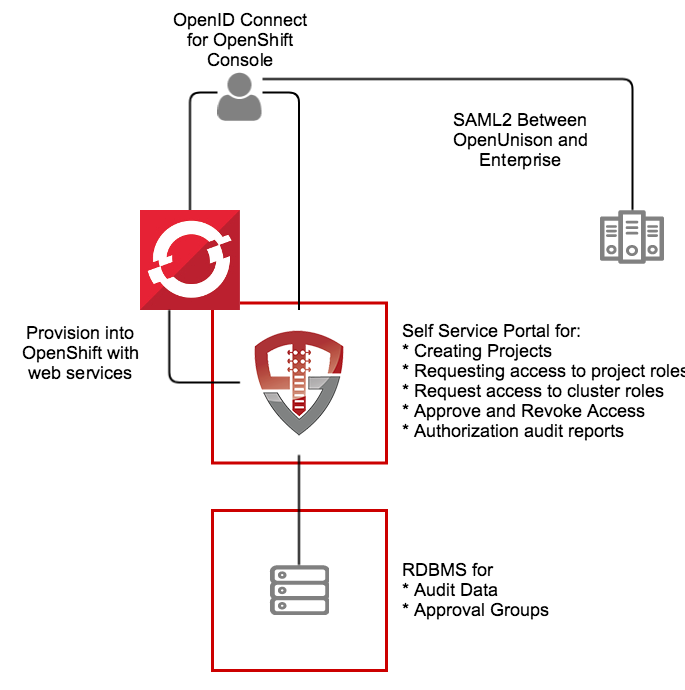

# OpenShift Identity Manager

This quick start for OpenUnison is designed to provide an identity management hub for OpenShift that will:

1. Provide an OpenID Connect Bridge for SAML2, multiple LDAP directories, add compliance acknowledgment, etc
2. Self service portal for requesting access to and getting approval for individual projects
3. Self service requests for gaining cluster level roles
4. Support removing users' access
5. Reporting

The quick start can run inside of OpenShift, leveraging OpenShift for scalability and secret management.  It can also be run externally to OpenShift.  



The OpenUnison deployment stores all OpenShift access information as a group in OpenShift, as opposed to a group in an external directory.  The only groups stored outside of OpenShift are approval groups which are stored in the relational database.

# Roles Supported

## Cluster

1.  Administration - Full cluster management access

## Projects

1.  Editors - Can edit and deploy into a project, can not manipulate users
2.  Viewers - Can view contents of a project, but can not make changes

## Non-OpenShift

1.  System Approver - Able to approve access to roles specific to OpenUnison
2.  Auditor - Able to view audit reports, but not request projects or approve access

# Deployment

The deployment model assumes:
1. OpenShift 3.x or higher (Origin or Downstream)
2. An image repository
3. Access to a certified RDBMS (may run on OpenShift)

These instructions cover using the Source-to-Image created by Tremolo Security for OpenUnison, but can be deployed into any J2EE container like tomcat, wildfly, etc.  The Source-to-Image builder will build a container image from your unison.xml and myvd.props file that has all of your libraries running a hardened version of Apache Tomcat 8.5 on the latest CentOS.  The keystore required for deployment will be stored as a secret in OpenShift.

## Generating Keystore

OpenUnison encrypts or signs everything that leaves it such as JWTs, workflow requests, session cookies, etc. To do this, we need to create a Java keystore that can be used to store these keys as well as the certificates used for TLS by Tomcat. When working with OpenShift something to take note of is Go does NOT work with self signed certificates that are not marked as CA:TRUE no matter how many ways you trust it. In order to use a self signed certificate you have to create a self signed certificate authority and THEN create a certificate signed by that CA. This can be done using Java's keytool but OpenSSL's approach is easier. To make this easier, the makecerts.sh script in this repository (`src/main/bash/makessl.sh`) (adapted from a similar script from CoreOS) will do this for you. Just make sure to change the subject in the script first:

```bash
$ sh makessl.sh
$ cd ssl
$ openssl pkcs12 -export -chain -inkey key.pem -in cert.pem -CAfile ca.pem -out openunison.p12
$ cd ..
$ keytool -importkeystore -srckeystore ./ssl/openunison.p12 -srcstoretype PKCS12 -alias 1 -destKeystore ./unisonKeyStore.jks -deststoretype JCEKS -destalias unison-tls
```

```bash
$ keytool -genseckey -alias session-unison -keyalg AES -keysize 256 -storetype JCEKS -keystore ./unisonKeyStore.jks
$ keytool -genseckey -alias lastmile-oidc -keyalg AES -keysize 256 -storetype JCEKS -keystore ./unisonKeyStore.jks

```

Then the SAML2 RP certificate
```bash
$ keytool -genkeypair -storetype JCEKS -alias unison-saml2-rp-sig -keyalg RSA -keysize 2048 -sigalg SHA256withRSA -keystore  ./unisonKeyStore.jks -validity 3650
```

Import the SAML2 signing certificate from your identity provider
```bash
$ keytool -import -trustcacerts -alias idp-saml2-sig -rfc -storetype JCEKS -keystore ./unisonKeyStore.jks -file /path/to/certificate.pem
```

Import the trusted certificate for OpenShift by looking for the certificate the master (Kubernetes API) server runs under.  This will depend on how you deployed OpenShift.  For instance for `oc cluster up` import the certificate from `/var/lib/origin/openshift.local.config/master/master.server.crt`:
```bash
$ keytool -import -trustcacerts -alias openshift-master -rfc -storetype JCEKS -keystore ./unisonKeyStore.jks -file /path/to/master.server.crt
```  


## Create OpenShift Service Account

The easiest way to create this account is to login to the OpenShift master to run oadm and oc (these instructions from OpenUnison's product manual):

```bash
$ oc new-project unison-service
$ oc project unison-service
$ cat <<EOF | oc create -n unison-service -f -
kind: ServiceAccount
apiVersion: v1
metadata:
  name: unison
EOF
$ oadm policy add-cluster-role-to-user cluster-admin system:serviceaccount:unison-service:unison
$ oc describe serviceaccount unison
$ oc describe secret unison-token-XXXX
```

In the above example, XXXX is the id of one of the tokens generated in the `Tokens` section of the output from the `oc describe serviceaccount unison`.  The final command will output a large, base64 encoded token.  This token is what OpenUnison will use to communicate with OpenShift.  Hold on to this value for the next step.

## Create cluster-admins Group

Login to the master via SSH to use the `oadm` tool.  

```bash
$ oadm groups new cluster-admins
$ oadm policy add-cluster-role-to-group cluster-admin cluster-admins
```

## Create Environments File

OpenUnison stores environment specific information, such as host names, passwords, etc, in a properties file that will then be loaded by OpenUnison.  This file will be stored in OpenShift as a secret then accessed by OpenUnison on startup to fill in the `#[]` parameters in `unison.xml` and `myvd.conf`.  For instance the parameter `#[OU_HOST]` in `unison.xml` would have an entry in this file.  Below is an example file, this file should be saved as `ou.env`:

```properties
OU_HOST=openunison.demo.aws
OU_HIBERNATE_DIALECT=org.hibernate.dialect.MySQL5InnoDBDialect
OU_JDBC_DRIVER=com.mysql.jdbc.Driver
OU_JDBC_URL=jdbc:mysql://mariadb.openunison.svc:3306/openunison
OU_JDBC_USER=unison
OU_JDBC_PASSWORD=start123
SMTP_HOST=smtp.gmail.com
SMTP_PORT=587
SMTP_USER=XXXX
SMTP_PASSWORD=XXXX
SMTP_FROM=donotreply@tremolosecurity.com
SMTP_TLS=true
OU_JDBC_VALIDATION=SELECT 1
OPENSHIFT_CONSOLE_URL=https://openshift.demo.aws:8443/console/
OPENSHIFT_URL=https://kubernetes.default.svc:443
OPENSHIFT_TOKEN=eyJhbG.....
OU_OIDC_OPENSHIFT_SECRET=secret
OU_OIDC_OPENSHIFT_REIDRECT=https://openshift.demo.aws:8443/oauth2callback/openunison
OPENSHIFT_OU_HOST=openunison.openunison.svc
unisonKeystorePassword=xxxx
IDP_POST=https://idp.ent2k12.domain.com/adfs/ls/
IDP_REDIR=https://idp.ent2k12.domain.com/adfs/ls/
IDP_LOGOUT=https://idp.ent2k12.domain.com/adfs/ls/
IDP_ENTITY_ID=https://idp.ent2k12.domain.com/adfs/services/trust
```

## Export SAML2 Metadata

Once your environment file is built, metadata can be generated for your identity provider.  First download the OpenUnion utilities jar file from `https://www.tremolosecurity.com/nexus/service/local/repositories/betas/content/com/tremolosecurity/unison/openunison-util/1.0.12.beta/openunison-util-1.0.12.beta-jar-with-dependencies.jar` and run the export:

```bash
$ $ java -jar ./openunison-util-1.0.12.beta.jar -action export-sp-metadata -chainName enterprise_idp -unisonXMLFile /path/to/openunison-qs-openshift/src/main/webapp/WEB-INF/unison.xml -keystorePath ./unisonKeyStore.jks -envFile ./ou.env -mechanismName SAML2 -urlBase https://openunison.demo.aws
```

Make sure to replace the `-urlBase` with the URL user for accessing OpenUnison.  It should use the same host as in OU_HOST.  This command will generate XML to the console that can be copied&pasted into a file that can be submited to your identity provider.


### Configure Identity Provider

Once the OpenUnison metadata is imported, make sure the following attributes are in the assertion:

| Attribute Name | Active Directory Attribute | Description |
| -------------- | -------------------------- | ----------- |
| uid            | samAccountName             | User's login id |
| givenName      | givenName                  | User's first name |
| sn             | sn                         | User's last name |
| mail           | mail                       | User's email address |

If using Active Directory Federation Services, you can use the following claims transformation rule:
```
c:[Type == "http://schemas.microsoft.com/ws/2008/06/identity/claims/windowsaccountname", Issuer == "AD AUTHORITY"]
 => issue(store = "Active Directory", types = ("http://schemas.xmlsoap.org/ws/2005/05/identity/claims/nameidentifier", "uid", "givenName", "sn", "mail"), query = ";sAMAccountName,sAMAccountName,givenName,sn,mail;{0}", param = c.Value);
```

## Build OpenUnison

OpenUnison is best built using the OpenUnison s2i builder.  This builder will pull your project from source control, build it (integrating the basic OpenUnison libraries) and create a docker image built on a hardened Tomcat 8.5 instance.  This image can then be pulled in from an OpenShift deployment.  The first step is to have Docker installed.  Then download the proper s2i build for your platform from https://github.com/openshift/source-to-image/releases.

```bash
$ docker pull docker.io/tremolosecurity/openunisons2idocker:latest
$ ./s2i build https://github.com/TremoloSecurity/openunison-qs-openshift.git docker.io/tremolosecurity/openunisons2idocker:latest docker.io/mlbiamdemos/openshift_openunison_commons:latest
$ docker push docker.io/mlbiamdemos/openshift_openunison_commons:latest
```

The first command pulls down the builder image from DockerHub.  The second command builds OpenUnison from the OpenShift quick start's GitHub repo and tags the resulting image for pushing to DockerHub in the mlbiamdemos repository.  This is where you would want to:

1. Fork Tremolo Security's github project so that you can customize it as needed
2. Tag the image with your own repository

### Using OpenShift Container Platform on Red Hat Enterprise Linux?

Tremolo Security has a Red Hat certified builder for OpenUnison.  Instead of `docker.io/tremolosecurity/openunisons2idocker:latest` use `registry.connect.redhat.com/tremolosecurity/openunison-s2i-10` to use the Red Hat certified container builder.

## Deploy OpenUnison

First create a project to host OpenUnison

```bash
$ oc new-project openunison
$ oc project openunison
```

Next create a secrets file for the `unisonKeyStore.jks` and `ou.env` file base base64 encoding each file and adding it to the `src/main/yaml/openunison-secrets.yaml` file.  Once the secrets are added, the secrets file can be added to your project:

```bash
$ oc create -f ./openunison-secrets.yaml
```

Next update `src/main/yaml/openunison-deployment.yaml` for the image you created in the previous step by updating the `image` attribute of the `containers` spec portion of the `template`.  Once updated, you can deploy OpenUnison:

```bash
$ oc create -f ./openunison-deployment.yaml
```

Once the deployment is complete you should be able to check the pod's logs and see that OpenUnison is running.  Now deploy the service from `src/main/yaml/openunison-service.yaml`:

```bash
$ oc create -f ./openunison-service.yaml
```

Finally, create a route so you can access OpenUnison using `src/main/yaml/openunison-route.yaml`:

```bash
$ oc create -f ./oepnunison-route.yaml
```

## First Login to the OpenShift Identity Manager

At this point you should be able to login to OpenUnison using the host specified in `openunison-route.yaml`.  Once you are logged in, logout.  Users are created in the database "just-in-time", meaning that once you login the data representing your user is created inside of the database we are pointing to in our `ou.env` file.

## Create First Administrator

The user you logged in as is currently unprivileged.  In order for other users to login and begin requesting access to projects this first user must be enabled as an approver.  Login to the MySQL database that is configured in `ou.env` and execute the following SQL:

```sql
insert into userGroups (userId,groupId) values (2,1);
```

This will add the administrator group to your user.  Logout of OpenUnison and log back in.

## Self Request & Approve Cluster Administrator

Once SSO is enabled in the next step, you'll need a cluster administrator to be able to perform cluster level operations:

1.  Login to OpenUnison
2.  Click on "Request Access" in the title bar
3.  Click on "OpenShift Administration"
4.  Click "Add To Cart" next to "Cluster Administrator"
5.  Next to "Check Out" in the title bar you'll see a red `1`, click on "Check Out"
6.  For "Supply Reason", give a reason like "Initial user" and click "Submit Request"
7.  Since you are the only approver refresh OpenUnison, you will see a red `1` next to "Open Approvals".  Click on "Open Approvals"
8. Click "Review" next to your email address
9. Specify "Initial user" for the "Justification" and click "Approve"
10. Click on "Confirm Approval"

At this point you will be provisioned to the `cluster-admins` group in OpenShift we created earlier.  Logout of OpenUnison and log back in.  If you click on your email address in the upper left, you'll see that you have the Role `OpenShift - cluster-admins`.  

## Enable SSO with OpenShift Console

This step will vary based on how you have deployed OpenShift.  These instructions assume your setup uses `oc cluster up`.  The first step is to have the OpenShift master(s) trust OpenUnison's TLS certificate.  For `oc cluster up` copy the the `ssl\ca.pem` file we created at the beginning of this tutorial to `/var/lib/origin/openshift.local.config/master/openunison_ca.crt`.

Next, edit `/var/lib/origin/openshift.local.config/master/master-config.yaml` to add the OpenID Connect configuration.  Under `oauthConfig` add an OpenID Connect Identity Provider:

```yaml
oauthConfig:
  alwaysShowProviderSelection: false
  assetPublicURL: https://openshift.demo.aws:8443/console/
  grantConfig:
    method: auto
    serviceAccountMethod: prompt
  identityProviders:
  - challenge: true
    login: false
    mappingMethod: claim
    name: anypassword
    provider:
      apiVersion: v1
      kind: AllowAllPasswordIdentityProvider
  - name: openunison
    challenge: true
    login: true
    mappingMethod: claim
    provider:
      apiVersion: v1
      kind: OpenIDIdentityProvider
      clientID: openshift
      clientSecret: XXXXX
      ca: /var/lib/origin/openshift.local.config/master/openunison_ca.crt
      claims:
        id:
        - sub
        preferredUsername:
        - preferred_username
        name:
        - name
        email:
        - email
      urls:
        authorize: https://openunison.demo.aws/auth/idp/OpenShiftIdP/auth
        token: https://openunison.demo.aws/auth/idp/OpenShiftIdP/token
```

In the above configuration, replace the `XXXXX` of `clientSecret` with the value of `OU_OIDC_OPENSHIFT_SECRET` from your `ou.env` file.  Also make sure that the urls use the same host names as defined in your `openunison-route.yaml` and are resolvable by DNS.  

Finally, restart the masters and you'll be able to login to the web console by clicking on the OpenShift badge in OpenUnison.

# Whats next?
Now you can begin mapping OpenUnison's capabilities to your business and compliance needs.  For instance you can add multi factor authentication with TOTP or U2F, Create privileged workflows for onboarding, scheduled workflows that will deprovision users, etc.
