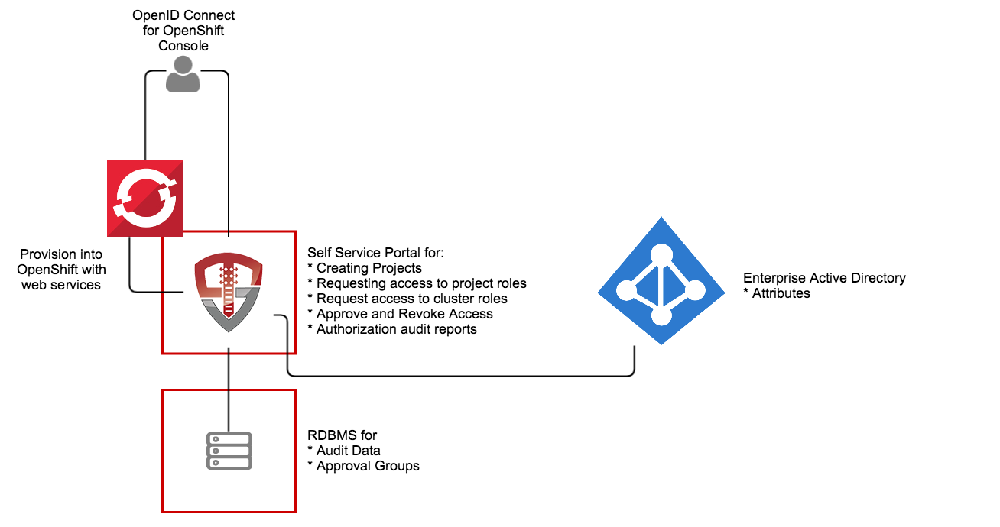

# OpenShift Identity Manager

This quick start for OpenUnison is designed to provide an identity management hub for OpenShift that will:

1. Provide an OpenID Connect Bridge for SAML2, multiple LDAP directories, add compliance acknowledgment, etc
2. Self service portal for requesting access to and getting approval for individual projects
3. Self service requests for gaining cluster level roles
4. Support removing users' access
5. Reporting

The quick start can run inside of OpenShift, leveraging OpenShift for scalability and secret management.  It can also be run externally to OpenShift.  

The OpenUnison deployment stores all OpenShift access information as a group in OpenShift, as opposed to a group in an external directory.  The only groups stored outside of OpenShift are approval groups which are stored in the relational database.

# Roles Supported

## Cluster

1.  Administration - Full cluster management access

## Projects

1.  Editors - Can edit and deploy into a project, can not manipulate users
2.  Viewers - Can view contents of a project, but can not make changes

## Non-OpenShift

1.  System Approver - Able to approve access to roles specific to OpenUnison
2.  Auditor - Able to view audit reports, but not request projects or approve access

# Deployment

The deployment model assumes:
1. OpenShift 3.x or higher (Origin or Downstream)
2. An image repository
3. Access to a certified RDBMS (may run on OpenShift)

These instructions cover using the Source-to-Image created by Tremolo Security for OpenUnison, but can be deployed into any J2EE container like tomcat, wildfly, etc.  The Source-to-Image builder will build a container image from your unison.xml and myvd.props file that has all of your libraries running a hardened version of Apache Tomcat 8.5 on the latest CentOS.  The keystore required for deployment will be stored as a secret in OpenShift.

## Getting Started...
